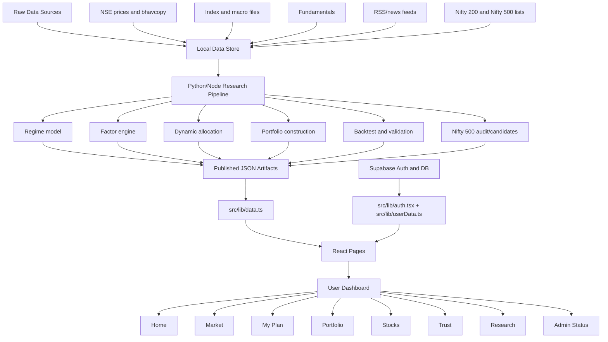
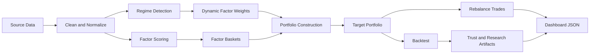
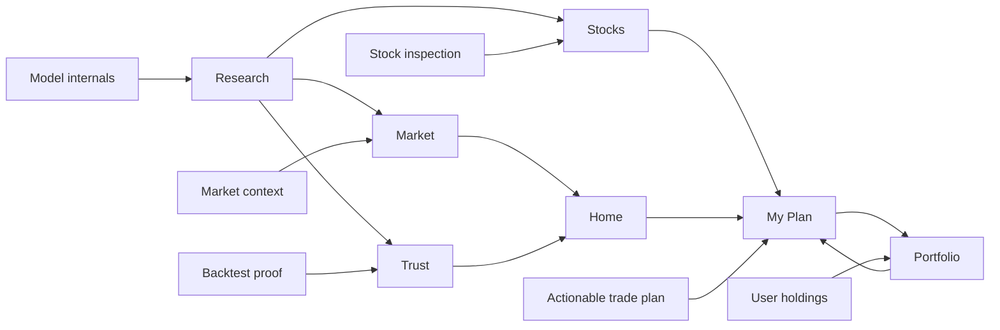

# Indian Factor Intelligence Dashboard - Technical Architecture

This document explains the project from an implementation point of view: what the system does, how data flows through the model pipeline, how the React application consumes the outputs, what each tab is responsible for, and how the pieces work together.

## 1. Project Purpose

The Indian Factor Intelligence Dashboard is a monthly positional equity intelligence and portfolio assistant for Indian markets.

The core idea is:

- detect the current market regime,
- score stocks on factor signals,
- dynamically allocate across factor sleeves,
- construct a portfolio recommendation,
- validate it using backtests and diagnostics,
- expose the result through a user-friendly dashboard,
- let a user compare the model against their own holdings and cash.

The validated portfolio recommendation layer is currently centered on the Nifty 200 universe. Nifty 500 is included as a broader discovery and AI-candidate universe, but it should not be described as equally validated until historical Nifty 500 membership, fundamentals, and full point-in-time backtests are completed.

## 2. Technology Stack

### Frontend

- React 18
- TypeScript
- Vite
- Tailwind CSS
- Lucide React icons
- Supabase JavaScript client for authentication and user data

Important files:

- `src/App.tsx`: route controller, authentication gate, onboarding gate, dashboard data loading.
- `src/components/Layout.tsx`: global shell, sidebar navigation, top data freshness label.
- `src/lib/data.ts`: loads generated JSON files and exposes typed getters.
- `src/lib/product.ts`: user-facing portfolio and trade-plan business logic.
- `src/lib/auth.tsx`: Supabase authentication context.
- `src/lib/userData.ts`: Supabase-backed user holdings, cash, preferences, watchlists, and trade-plan persistence.
- `src/types/index.ts`: shared TypeScript interfaces for all published data artifacts.

### Data And Model Pipeline

- Python scripts generate most model, backtest, and research artifacts.
- Node scripts support specific frontend-facing exports such as Nifty 500 audit/candidates.
- SQLite and local CSV/parquet files are used as the main offline data sources.
- Published dashboard artifacts are emitted as JSON under `public/data/`.

Important files:

- `scripts/run_pipeline.py`: main model/data pipeline.
- `scripts/run_langgraph_pipeline.py`: orchestration/reporting style pipeline wrapper.
- `scripts/daily_eod_refresh.py`: daily NSE EOD refresh workflow.
- `scripts/factor_engine.py`: factor score logic.
- `scripts/regime_model.py`: regime modeling.
- `scripts/portfolio_construction.py`: target portfolio construction.
- `scripts/stock_backtest.py`: stock-level backtest.
- `scripts/backtest_reporting.py`: backtest reporting artifacts.
- `scripts/temporal_protocol.py`: temporal validity rules.
- `scripts/point_in_time.py`: point-in-time universe handling.
- `scripts/historical_universe.py`: historical membership resolution.
- `scripts/historical_price_data.py`: historical price processing.
- `scripts/audit_nifty500_data.mjs`: Nifty 500 coverage audit.
- `scripts/build_nifty500_ai_candidates.mjs`: Nifty 500 AI candidate export.

### Persistence

Static model artifacts are served from `public/data/*.json`.

User-specific state is persisted through Supabase:

- authentication,
- profile/role,
- holdings,
- cash,
- preferences,
- watchlist,
- saved trade plans.

Database schema:

- `supabase_schema.sql`

## 3. High-Level Architecture Diagram



## 4. Runtime Flow

When the app starts:

1. `src/main.tsx` mounts React.
2. `src/App.tsx` wraps the app in `AuthProvider`.
3. `AuthProvider` checks Supabase session state.
4. `AppInner` calls `loadDashboardData()` from `src/lib/data.ts`.
5. `loadDashboardData()` fetches all required JSON files from `/data/*.json`.
6. If the user is not authenticated, `LoginPage` is shown.
7. If the user is authenticated but has no onboarding/user data, `OnboardingPage` is shown.
8. After data and user state are ready, `Layout` renders the selected tab.

The app uses a lightweight client-side route system:

| URL | Page ID | Component |
| --- | --- | --- |
| `/` | `command-center` | `CommandCenterPage` |
| `/market` | `market-view` | `MarketViewPage` |
| `/plan` | `trade-plan` | `TradePlanPage` |
| `/portfolio` | `my-portfolio` | `FinalPortfolioPage` |
| `/stock` | `stock-inspector` | `StockInspectorPage` |
| `/trust` | `performance-trust` | `PerformanceTrustPage` |
| `/research` | `advanced-research` | `AdvancedResearchPage` |
| `/admin-status` | `admin-status` | `AdminStatusPage` |

## 5. Published Data Artifacts

The frontend does not directly run the model. It reads generated JSON snapshots from `public/data`.

Core files loaded by `src/lib/data.ts`:

| Artifact | Purpose |
| --- | --- |
| `regime_predictions.json` | Monthly regime labels, probabilities, confidence, transition risk. |
| `factor_baskets.json` | Stock membership in factor sleeves such as Value, Quality, Momentum, Low Volatility. |
| `factor_returns.json` | Historical factor sleeve returns. |
| `factor_diagnostics.json` | Factor quality, coverage, redundancy, and diagnostics. |
| `factor_allocations.json` | Dynamic allocation weights by factor and month. |
| `allocation_decisions.json` | Monthly decision gate such as RETAIN, REBALANCE, or DEFENSIVE. |
| `portfolio_targets.json` | Final target weights for the model portfolio. |
| `rebalance_trades.json` | Month-level trade changes from old weights to new weights. |
| `stock_signal_events.json` | Stock-level signal/event history. |
| `stock_prices.json` | Monthly stock price history used by the UI. |
| `stocks.json` | Stock metadata such as symbol, name, sector. |
| `market_index.json` | Market index values such as Nifty series and VIX where available. |
| `macro_monthly.json` | Macro data used by the regime/model views. |
| `news_features.json` | Monthly news feature aggregates. |
| `news_features_daily.json` | Daily news stress/sentiment features. |
| `news_articles_raw.json` | Raw news article summaries shown in market/research pages. |
| `backtest_portfolio.json` | Strategy equity curve/portfolio history. |
| `backtest_summary.json` | Strategy comparison summary metrics. |
| `backtest_performance_report.json` | Detailed backtest reliability report. |
| `backtest_cost_scenarios.json` | Transaction-cost sensitivity outputs. |
| `portfolio_constraint_compliance.json` | Constraint checks on portfolio construction. |
| `experiment_manifest.json` | Run metadata, data freshness, assumptions, fingerprints. |
| `point_in_time_universe.json` | Point-in-time survivorship information. |
| `historical_universe_coverage.json` | Historical membership coverage summary. |
| `historical_universe_resolution.json` | Month-by-month membership resolution. |
| `fundamental_coverage_audit.json` | Fundamental-data coverage and caveats. |
| `nifty500_data_audit.json` | Nifty 500 expansion readiness and coverage audit. |
| `recommendation_universes.json` | Nifty 200 validated basket plus Nifty 500 AI candidate layer. |
| `eod_refresh_status.json` | Latest EOD refresh status and dates. |
| `langgraph_run_report.json` | Pipeline orchestration report. |
| `data_inventory.json` | Inventory of available source files/tables. |

## 6. Core Frontend Data Layer

`src/lib/data.ts` is the central read-only data access layer.

It stores each loaded JSON file in module-level variables and exposes getter functions such as:

- `getLatestRegime()`
- `getLatestAllocation()`
- `getLatestDecision()`
- `getPortfolioTargets()`
- `getStockPrices(symbol)`
- `getSignalEvents(symbol)`
- `getNifty500DataAudit()`
- `getRecommendationUniverses()`
- `getExperimentManifest()`
- `getBacktestSummary()`
- `getPerformanceReport()`

This design means pages do not fetch raw files themselves. They call typed getters and focus on presentation.

## 7. Core Product Logic

`src/lib/product.ts` turns model outputs plus user inputs into practical decision support.

Main responsibilities:

- normalize user holdings,
- parse CSV/pasted holdings,
- calculate latest price from stock price history,
- assess daily execution risk,
- build rebalancing trade plans,
- build fresh-cash deployment plans,
- explain the model decision in user-readable language,
- prepare CSV exports,
- compare backtest strategies.

Important functions:

| Function | Role |
| --- | --- |
| `sanitizeHoldings` | Normalizes symbols, removes invalid rows, aggregates duplicate holdings. |
| `parseHoldingsText` | Reads manual/pasted holdings text. |
| `parseHoldingsCsv` | Reads broker-style CSV holdings files. |
| `getLatestPrice` | Finds the latest monthly adjusted close or close for a symbol. |
| `assessDailyRisk` | Converts turnover, confidence, news stress, and data status into Normal/Caution/Danger/Extreme. |
| `buildTradePlan` | Compares current holdings to target portfolio and produces BUY/ADD/SELL/REDUCE/HOLD rows. |
| `buildCashDeploymentPlan` | Converts fresh cash into possible model-basket buys only when the gate allows it. |
| `buildDeterministicExplanation` | Explains why the plan is deploy/stagger/wait/hold. |
| `getDecisionSnapshot` | Bundles latest decision, allocation, risk, model month, and EOD date. |
| `getBenchmarkVerdicts` | Converts backtest summaries into trust-page verdicts. |

The important safety rule is that the app does not automatically generate fresh buy orders when the monthly decision is `RETAIN`. It can show raw model differences for transparency, but execution waits until the model gate approves action.

## 8. Model Pipeline Concept

The model pipeline can be understood as a sequence:



### Regime Detection

Implemented mainly through `scripts/regime_model.py` and the regime portions of `scripts/run_pipeline.py`.

It uses macro/market features to assign a market regime label and confidence. The frontend surfaces this in Home, Market, Research, and Trust pages.

### Factor Scoring

Implemented through `scripts/factor_engine.py` and pipeline logic.

The main factor families are:

- Value,
- Quality,
- Momentum,
- Low Volatility.

The factor engine ranks stocks, produces baskets, and emits diagnostics. These outputs become `factor_baskets.json`, `factor_returns.json`, and `factor_diagnostics.json`.

### Dynamic Allocation

The system changes factor weights depending on the detected regime and allocation logic. The outputs are stored in `factor_allocations.json` and `allocation_decisions.json`.

The decision gate determines whether the app should:

- retain current positioning,
- rebalance,
- move defensive.

### Portfolio Construction

The pipeline transforms factor sleeve outputs and weights into target stock weights, while respecting constraints such as position caps and diversification limits. The main output is `portfolio_targets.json`.

### Backtesting And Validation

Backtest artifacts evaluate whether the model worked historically under the available data constraints.

Important outputs:

- `backtest_portfolio.json`
- `backtest_summary.json`
- `backtest_stock_level.json`
- `backtest_stock_level_summary.json`
- `backtest_performance_report.json`
- `backtest_cost_scenarios.json`
- `backtest_ablation.json`

The Research and Trust pages use these artifacts to show not only performance, but also limitations.

## 9. Universe Policy

### Nifty 200

Nifty 200 is the validated production recommendation universe.

It has:

- current stock metadata,
- historical price data,
- factor scoring,
- portfolio targets,
- rebalancing trades,
- point-in-time historical membership logic,
- backtest/report artifacts.

This is why the app can treat Nifty 200 as the actual recommendation model.

### Nifty 500

Nifty 500 is used more carefully.

Current Nifty 500 support includes:

- current constituent audit,
- price coverage audit,
- user-facing discovery/search support,
- AI candidate ranking export,
- `recommendation_universes.json` support.

However, Nifty 500 should not be presented as equally backtested unless the following are completed:

- historical Nifty 500 membership snapshots,
- full fundamentals coverage,
- point-in-time Nifty 500 backtest,
- leakage checks under the same protocol as Nifty 200.

The product distinction is:

- Nifty 200: validated portfolio recommendation model.
- Nifty 500: broader AI-ranked discovery/candidate universe.

## 10. Tab-By-Tab Implementation

### 10.1 Login

Component:

- `src/pages/LoginPage.tsx`

Purpose:

- handles Supabase sign-in and sign-up,
- shows configuration errors when Supabase environment variables are missing,
- returns control to `App.tsx` after login.

Connected modules:

- `src/lib/auth.tsx`
- `src/lib/supabase.ts`

### 10.2 Onboarding

Component:

- `src/pages/OnboardingPage.tsx`

Purpose:

- collects initial user experience information,
- distinguishes users with existing holdings from users with fresh capital,
- stores local/user experience state,
- helps decide whether My Plan starts in fresh-money mode or rebalance mode.

Connected modules:

- `src/lib/userExperience.ts`
- `src/lib/userData.ts`
- `src/App.tsx`

### 10.3 Home

Component:

- `src/pages/CommandCenterPage.tsx`

Purpose:

- provides the main summary view,
- shows current model/market state,
- exposes key actions for My Plan, Trust, and Research,
- translates technical model state into user-level next steps.

Key data:

- latest regime,
- latest allocation,
- latest decision,
- benchmark verdicts,
- EOD freshness.

### 10.4 Market

Components:

- `src/pages/MarketViewPage.tsx`
- `src/pages/MarketViewPagePro.tsx`

Purpose:

- gives a market briefing instead of raw data dumps,
- combines index movement, VIX/risk signals, macro context, news context, sector behavior, and model positioning,
- avoids overreacting to a single negative article by grouping news into themes.

Key data:

- `market_index.json`
- `macro_monthly.json`
- `news_features.json`
- `news_features_daily.json`
- `news_articles_raw.json`
- `factor_allocations.json`
- `regime_predictions.json`
- `sector_index.json`

How it connects:

- Market gives context for why the model may be constructive, selective, or defensive.
- My Plan then converts the model state into user-specific trade guidance.

### 10.5 My Plan

Component:

- `src/pages/TradePlanPage.tsx`

Purpose:

- turns model targets plus user holdings/cash into a practical plan,
- supports fresh-investor and rebalance workflows,
- lets users add holdings manually, paste holdings, or import holdings CSV,
- includes stock-symbol autocomplete,
- can save a draft trade plan to Supabase,
- can export trade plan CSV.

Key product logic:

- `buildTradePlan`
- `buildCashDeploymentPlan`
- `assessDailyRisk`
- `buildDeterministicExplanation`

Important behavior:

- The 25k or preferred capital can prefill from onboarding.
- A recommendation is not the same as blind execution.
- If monthly decision is `RETAIN`, the app tells the user to wait rather than forcing fresh buys.
- If daily risk is `Caution`, buys may be staggered.
- If daily risk is `Danger` or `Extreme`, new buys are paused.
- Sell/reduce actions can remain available because they reduce exposure.

How it connects:

- Reads model target weights from `portfolio_targets.json`.
- Reads prices from `stock_prices.json`.
- Reads the decision gate from `allocation_decisions.json`.
- Reads user holdings/cash from Supabase.
- Saves the resulting draft plan back to Supabase.

### 10.6 Portfolio

Component:

- `src/pages/FinalPortfolioPage.tsx`

Purpose:

- displays the user's saved holdings and current value,
- compares portfolio holdings against the model target,
- surfaces P/L where average price is available,
- gives action labels based on model alignment.

Connected modules:

- `src/lib/userData.ts`
- `src/lib/product.ts`
- `src/lib/data.ts`

How it connects:

- Portfolio is the user's current state.
- My Plan is the recommended transition from current state to target state.

### 10.7 Stocks

Component:

- `src/pages/StockInspectorPage.tsx`

Purpose:

- searchable stock-level investigation page,
- includes Nifty 200 model-basket stocks and broader Nifty 500 discovery symbols,
- shows price history, signal history, model membership, factor status, and Nifty 500 discovery status,
- labels stocks that are discovery-only differently from validated basket stocks.

Key data:

- `stocks.json`
- `stock_prices.json`
- `stock_signal_events.json`
- `portfolio_targets.json`
- `factor_baskets.json`
- `nifty500_data_audit.json`
- `recommendation_universes.json`

How it connects:

- Helps the user inspect "why this stock?" before acting in My Plan.
- Lets the broader Nifty 500 layer be useful without pretending it has full Nifty 200-level validation.

### 10.8 Trust

Component:

- `src/pages/PerformanceTrustPage.tsx`

Purpose:

- gives user-facing proof and caution,
- explains model performance, benchmark comparison, reliability, caveats, and whether the strategy should be trusted.

Key data:

- `backtest_summary.json`
- `backtest_performance_report.json`
- `backtest_cost_scenarios.json`
- `portfolio_constraint_compliance.json`
- `experiment_manifest.json`
- `fundamental_coverage_audit.json`

How it connects:

- Trust turns research artifacts into plain-English confidence and limitation statements.
- It supports the user-facing claim that the app is evidence-based, not just a recommendation screen.

### 10.9 Research

Component:

- `src/pages/AdvancedResearchPage.tsx`

Purpose:

- contains the full technical research area,
- organizes deep model internals into sections,
- acts as the transparent technical audit trail.

Sections:

| Section | Component | Purpose |
| --- | --- | --- |
| Overview | inline in `AdvancedResearchPage` | Explains the research area. |
| Regime Analysis | `RegimePage` | Regime labels, transition matrix, probabilities, confidence. |
| Factor Analysis | `FactorPage` | Factor scores, baskets, returns, diagnostics. |
| Allocation Diagnostics | `AllocationPage` | Factor weights, model decision gate, allocation reasoning. |
| News & Narrative | `NewsPage` | News sentiment, relevance, stress, articles. |
| Backtest Diagnostics | `BacktestPage` | Historical strategy evidence and comparison. |
| Model Integrity | `ModelIntegrityPage` | Manifest, assumptions, determinism, caveats. |
| Model Report | `ModelReportPage` | Universe coverage, data inventory, exclusions. |
| Universe Audit | inline `UniverseAudit` | Nifty 500 readiness and coverage. |
| Signal History | `SignalsPage` | Stock-level signal events. |
| Simulation | `SimulationPage` | Historical simulation/replay. |

How it connects:

- Research explains how the Home, Market, My Plan, Portfolio, Stocks, and Trust pages got their conclusions.
- It is the technical transparency layer for the whole system.

### 10.10 Admin Status

Component:

- `src/pages/AdminStatusPage.tsx`

Purpose:

- admin-only operational status view,
- shows backend/data/pipeline state,
- exposes admin diagnostics without showing it to normal users.

Access:

- `src/App.tsx` blocks `/admin-status` for non-admin users.
- `src/components/Layout.tsx` hides the tab unless `isAdmin` is true.

## 11. How The Tabs Work Together



The intended user journey:

1. Home summarizes what the model currently says.
2. Market explains the environment behind the model.
3. Trust shows whether the system has evidence and what limitations remain.
4. Stocks lets the user inspect individual names.
5. Portfolio shows the user's current holdings.
6. My Plan converts model targets plus user holdings/cash into actions.
7. Research is available whenever the user needs full technical detail.

## 12. Authentication And User Data

Supabase is used for:

- account authentication,
- role lookup,
- audit events,
- user holdings,
- cash,
- preferences,
- watchlists,
- saved trade plans.

Important modules:

- `src/lib/supabase.ts`: initializes Supabase client from `VITE_SUPABASE_URL` and `VITE_SUPABASE_ANON_KEY`.
- `src/lib/auth.tsx`: owns login/session/user role state.
- `src/lib/userData.ts`: reads/writes user-specific portfolio state.

Important safety detail:

The frontend role check is for navigation only. Actual security should be enforced through Supabase Row Level Security policies defined in `supabase_schema.sql`.

## 13. Build, Validation, And Dev Commands

Project scripts from `package.json`:

| Command | Purpose |
| --- | --- |
| `npm run dev` | Start Vite dev server. |
| `npm run dev:5174` | Start Vite on port 5174. |
| `npm run build` | Production build. |
| `npm run lint` | ESLint check. |
| `npm run typecheck` | TypeScript compile check without emitting files. |
| `npm run preview` | Preview production build. |
| `npm run eod` | Run daily EOD pipeline through PowerShell wrapper. |
| `npm run dev:eod` | Run EOD pipeline, then start dev server. |

Recommended verification after implementation changes:

```powershell
npm run typecheck
npm run lint
npm run build
```

For pipeline/data changes, also run the relevant Python/Node scripts and tests:

```powershell
python scripts/test_dashboard_contracts.py
python scripts/test_temporal_validity.py
python scripts/test_leakage.py
python scripts/test_historical_price_data.py
python scripts/test_backtest_reporting.py
node scripts/audit_nifty500_data.mjs
node scripts/build_nifty500_ai_candidates.mjs
```

## 14. Deployment Model

The app is a Vite single-page application. After `npm run build`, production files are emitted to `dist/`.

The Vercel deployment serves the built app and the static `public/data` JSON artifacts.

Important deployment requirement:

- SPA routing must fall back to `index.html`, otherwise URLs like `/plan`, `/stock`, and `/research` can fail on hard refresh.

## 15. Current Implementation Status

Current high-level status:

- React app is implemented as a full dashboard.
- Authentication and user persistence use Supabase.
- Published static data artifacts drive the model views.
- Nifty 200 is the validated recommendation universe.
- Nifty 500 is available as broader discovery and AI candidate coverage.
- My Plan converts holdings/cash plus model outputs into practical actions.
- Research and Trust expose validation, caveats, and diagnostics.

Known important limitation:

Nifty 500 should not be marketed as fully point-in-time backtested until its historical universe, fundamentals coverage, and model validation match the Nifty 200 standard.

## 16. Mental Model For Explaining The Project

Use this simple explanation:

> The backend pipeline does the research and creates audited JSON snapshots. The frontend does not invent recommendations live; it reads those snapshots, combines them with the user's holdings and cash, and explains the result through product pages. Research proves how the model works, Trust explains whether the model should be believed, Market gives context, Stocks lets the user inspect names, Portfolio shows where the user is now, and My Plan tells the user what action is practical today.

